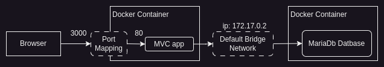

# Hands-On Docker

1. [Exercício 1 - ASP.NET - Demonstração prática do ciclo de build, login, push e run](#exercício-1)
1. [Exercício 2 - Dockerfile - demonstrando o problema de não ter um volume](#exercício-2)
1. [Exercício 3 - Dockerfile - demonstrando o uso do volume](#exercício-3)
1. [Exercício 4 - ASP.NET - Aplicação acessando o banco sem compose](#exercício-4)

## Exercício 1

Código Fonte [aqui](https://gitlab.com/jeann-andrade/dockerexamples/-/tree/main/ExampleApp?ref_type=heads)

Nesse exercício a imagem não tem o SDK para poder buildar o app. Então o app está sendo buildado previamente numa pasta *dist* e o *Dockerfile* tem as instruções para copiar os binários para dentro da imagem.

- [x] uso de dockerfile
- [x] criação de imagem
- [ ] criação de volume
- [ ] criação de rede (network)
- [ ] uso de compose
- [ ] uso de swarm
- [x] publicação em docker hub
- [x] rodando container em play with docker

Passo 1 - criar localmente o pacote de binários da aplicação:

`dotnet publish --framework net7.0 --configuration Release --output dist`

Passo 2 - criar a imagem a partir do arquivo Dockerfile disponível na pasta raiz do projeto

`docker build . -t jeannandrade01/exampleapp -f Dockerfile`

Passo 3 - Verificar se imagem foi criada

`docker images`

Passo 4 - Fazer login no docker hub

`docker login`

Passo 5 - Subir a imagem criada para o docker hub

`docker push jeannandrade01/exampleapp:latest`

Passo 6 - Criar um container a partir da imagem do docker hub

No PLay With Docker, inicie uma nova sessão e entre com o comando:

`docker run -d --name web1 -p 8080:80 jeannandrade01/exampleapp:latest`

## Exercício 2

Código Fonte [aqui](https://gitlab.com/jeann-andrade/dockerexamples/-/tree/main/ExampleApp02?ref_type=heads)

Nesse exercício dados estão sendo armazenados no sistema de arquivos do container. O objetivo é mostrar o problema criado por não fazer uso de volume.

- [x] uso de dockerfile
- [x] criação de imagem
- [ ] criação de volume
- [ ] criação de rede (network)
- [ ] uso de compose
- [ ] uso de swarm
- [ ] publicação em docker hub
- [x] rodando container em play with docker

Passo 1 - Clonar o projeto no Play With Docker e criar a imagem a partir do arquivo Dockerfile disponível na pasta raiz do projeto

`docker build . -t vtest -f Dockerfile.volumes`

Passo 2 - Rodar um container para ver que um arquivo foi de fato criado no filesystem do container

`docker run --name vtest vtest`

Passo 3 - Iniciar o container novamente para ver que o arquivo ainda existe

`docker start -a vtest`

Passo 4 - Remover o container, apagando seu conteúdo

`docker rm -f vtest`

Passo 5 - Criar um novo container para ver que o arquivo se perdeu, tendo o container criado um novo

`docker run --name vtest vtest`

## Exercício 3

Código Fonte [aqui](https://gitlab.com/jeann-andrade/dockerexamples/-/tree/main/ExampleApp03?ref_type=heads)

Nesse exercício dados estão sendo armazenados no volume. O objetivo é mostrar o problema citado no exercício 2 foi resolvido.

- [x] uso de dockerfile
- [x] criação de imagem
- [x] criação de volume
- [ ] criação de rede (network)
- [ ] uso de compose
- [ ] uso de swarm
- [ ] publicação em docker hub
- [x] rodando container em play with docker

Passo 1 - Clonar o projeto no Play With Docker e criar a imagem a partir do arquivo Dockerfile disponível na pasta raiz do projeto

`docker build . -t vtest -f Dockerfile.volumes`

Passo 2 - Criar o volume no host

`docker volume create --name testdata`

Passo 3 - Rodar um container associando o volume do Host com o volume esperado no *Dockerfile*

`docker run --name vtest2 -v testdata:/data vtest`

Passo 4 - Remover o container, apagando seu conteúdo

`docker rm -f vtest2`

Passo 5 - Criar um novo container para ver que o arquivo continua lá, não foi perdido com a exclusão do container

`docker run --name vtest vtest`

## Exercício 4

Código Fonte [aqui](https://gitlab.com/jeann-andrade/dockerexamples/-/tree/main/ExampleApp04?ref_type=heads)

Nesse exercício dados estão sendo armazenados em volume. Uma aplicação ASP.NET vai rodar acessando um DB MariaDb rodando em outro container. A comunicação entre os containers é feita através da rede bridge padrão (Default Bridge Network) que tem duas limitações principais: é preciso executar o comando `docker network inspect bridge` para saber o IP atribuído ao container e, todos os containers da solução estarão na mesma rede, o que não é uma boa prática quando se trabalha com docker.

- [x] uso de dockerfile
- [x] criação de imagem
- [x] criação de volume
- [ ] criação de rede (network)
- [ ] uso de compose
- [ ] uso de swarm
- [ ] publicação em docker hub
- [x] rodando container em play with docker

Passo 1 - Clonar o projeto no Play With Docker e criar a imagem a partir do arquivo Dockerfile disponível na pasta raiz do projeto

`docker build . -t aspnet_ex04 -f Dockerfile`

Passo 2 - Criar o volume no host

`docker volume create --name productdata`

Passo 3 - Criar o container do banco MariaDb

`docker run -d --name mariadb -v productdata:/var/lib/mysql --env MARIADB_USER=example-user --env MARIADB_PASSWORD=my_cool_secret --env MARIADB_DATABASE=products --env MARIADB_ROOT_PASSWORD=my-secret-pw  mariadb:11.1.2`

Passo 4 - Inspecionar o container do banco para ver qual ip o docker atribuiu a ele

`docker network inspect bridge`

Passo 5 - Rodar um segundo container com a aplicação ASP.NET a partir da imagem criada alterando o IP do DBHost

`docker run -d --name productapp -p 3000:80 -e DBHOST=172.17.0.2 aspnet_ex04:latest`

Passo 6 - Examinar o log do container para ver os comandos sendo executados

`docker logs -f productapp`

Veja a composição de rede criada pelo docker para este exercício. O uso da rede Bridge para conectar os dois containers.

O navegador envia sua requisição HTTP para a porta 3000 no sistema operacional host que o Docker mapeia para a porta 80 no contêiner do aplicativo MVC. O aplicativo MVC solicita que o Entity Framework Core forneça dados, o que ele faz usando a rede bridge padrão para se comunicar com o aplicativo MariaDb em execução em um contêiner separado.
