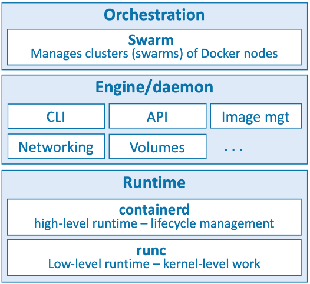
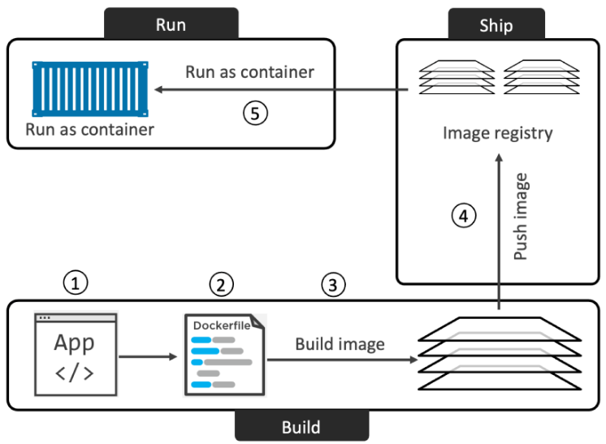

# Docker (Table of contents)

Este é um resumo de dois livros:

* Docker Deep Dive: Zero to Docker in a Single Book, Nigel Poulton.
* Essential Docker for ASP.NET Core MVC, Adam Freeman.

Para clonar o repositório: git clone <https://github.com/nigelpoulton/ddd-book.git>

1. [Comandos do CLI](#comandos-do-cli)
    1. [Verificação](#comandos-de-verificação)
    1. [Imagem](#comandos-sobre-imagem)
    1. [Contêiner](#comandos-sobre-contêiner)
    1. [Compose](#comandos-sobre-compose)
    1. [Multipass](#comandos-sobre-multipass)
    1. [Volume](#comandos-sobre-volume)
    1. [Network](#comandos-sobre-network)
    1. [Docker Hub](#comandos-sobre-docker-hub)
1. [A tecnologia Docker](#a-tecnologia-docker)
1. [Imagem](#imagem)
1. [Contêiner](#cont%C3%AAineres)
1. [Volume](#volumes)
1. [Network](#network-software-defined-network-sdn)
1. [DockerFile](#dockerfile)
1. [Como por um app em contêiner a partir do código fonte](#como-contêinerizar-um-app-a-partir-de-um-código-fonte)
1. [Docker Compose](#compose)
1. [Docker Swarm](#docker-swarms)
1. [Hands-On Docker](./hands_on/index.html)
1. [Como instalar o Docker](./como_instalar/index.html)

## Comandos do CLI

### Comandos de verificação

| Comando | Descrição
| ----- | ----- |
| `docker version` | Obtém informações sobre as versões e testa se o client e o Deamon (server) estão executando e falando um com o outro |
| `docker info` | Obtém informações mais detalhadas do client e do server sobre os recursos que o Docker está gerenciando, como contêineres, imagens, volumes... |

### Comandos associados a recursos

#### Comandos sobre imagem

| Comando | Descrição | Exemplo |
| ----- | ----- | ------ |
| `docker build` | constrói uma imagem a partir de um dockerfile | `docker build -t test:latest .` |
| `docker images` | Lista as imagens já baixadas | `docker images` |
| `docker pull` | obtém uma imagem da sua lista de fontes de imagem (default é dockerhub) | `docker pull ubuntu:latest` ou `docker pull nigelpoulton/tu-demo:v2` ou `docker pull gcr.io/google-containers/git-sync:v3.1.5` |
| `docker push` | Comando para subir a imagem para o Docker Hub | `docker push nigelpoulton/ddd-book:ch8.1` |
| `docker tag` | Esse comando serve para adicionar uma nova tag a imagem, sem sobrescrever a original. Para subir para o Docker Hub é preciso que a tag seja precedida do seu "id de usuário" | `docker tag ddd-book:ch8.1 nigelpoulton/ddd-book:ch8.1` |
| `docker rmi` | remover uma imagem que não é mais usada. Não é possível apagar uma imagem que está em uso por um contêiner. Será preciso parar o contêiner e apagá-lo antes de apagar a imagem. | `docker rmi 44dd6f223004` |
| `docker rmi $(docker images -q) -f` | remover todas as imagens de uma só vez. | `docker rmi $(docker images -q) -f` |
| `docker inspect vtest` | inspeciona uma imagem. É especialmente útil na hora de descobrir se uma imagem usa volume | |

___

#### Comandos sobre contêiner

| Comando | Descrição | Exemplo |
| ----- | ----- | ------ |
| `docker run <image> <app>` | Executa um contêiner usando uma imagem como base | Ex1: `docker run -it ubuntu:latest /bin/bash`; Ex2: `docker run -d --name web1 --publish 8080:8080 test:latest` |
| `docker ps` | Lista os contêiner em execução. Use -a para listar inclusive os contêineres parados | `docker ps` |
| `Press Ctrl-PQ` | para sair do contêiner sem finalizá-lo. O terminal sairá do terminal do contêiner para o terminal do host | |
| `docker exec` | anexa seu shell ao terminal de um contêiner em execução | `docker exec -it vigilant_borg bash` |
| `docker stop` | Para a execução do contêiner | `docker stop id_contêiner` ou `docker stop $(docker ps -q)` para parar todos |
| `docker start` | Reinicializa um container parado com o comando stop | `docker start id_contêiner` ou `docker start $(docker ps -aq)` para iniciar todos |
| `docker rm` | Elimina o contêiner |`docker rm id_container` |
| `docker rm $(docker ps -aq)` | Elimina todos os contêineres de uma vez |`docker rm -f $(docker ps -aq)` vai forçar a parada do contêiner e depois eliminá-lo |
| `docker logs` | Exibe os logs gerados pelo contêiner | `docker logs nome_container` e para exibir o log de forma contínua `docker logs -f nome_container` |

Argumentos para o comando run:

| Comando | Descrição |
| ----- | ----- |
| -e, --env | configura uma variável de ambiente |
| --name | associa um nome ao contêiner |
| --network | conecta o contêiner a uma rede definida por software |
| -d | executa o contêiner em background e print o contêiner ID |
| -p, --publish | cria um mapeamento entre portas, externa e interna ao contêiner |
| --rm | remove o contêiner quando ele para. |
| -v, --volume | configura um volume que irá prover um conteúdo para uma pasta no sistema de arquivos do contêiner. |

___

#### Comandos sobre Compose

| Comando | Descrição | Exemplo |
| ----- | ----- | ------ |
| `docker compose version` | Para verificar a versão do docker-compose instalado | |
| `docker compose up` | Para levantar a aplicação | deve ser rodado na pasta onde está o compose.yaml. `--detach` para subir em background |
| `docker compose up -f compose_file.yaml` | Para levantar a aplicação | caso o arquivo compose esteja com outro nome |
| `docker compose -f docker-compose.yml build` | processa o conteúdo do arquivo compose e cria as imagens para os container que ele contém. | |
| `docker compose stop` | para os containers. Containers, redes e volumes são mantidos para serem iniciados novamente. | |
| `docker compose down` | para os serviços e remove Containers e redes. Volumes são mantidos por serem persistentes | `--volumes` para remover os volumes também. `--rmi all` irá apagar as imagens criadas também |
| `docker compose ls` | lista os containers que foram criados para os serviços definidos no arquivo compose. | |
| `docker compose top` | lista os processos em execução em cada contêiner. | Os números PID retornados são os números PID vistos no host Docker (não nos contêineres). |
| `docker compose rm` |  Apaga um app compose que já esteja parado | deleta somente os contêineres e as redes |
| `docker compose restart` | reinicia um aplicação compose que estava parada | |

___

#### Comandos sobre Multipass

| Comando | Descrição | Exemplo |
| ----- | ----- | ------ |
| `multipass launch --name foo` | Launch an instance (by default you get the current Ubuntu LTS) | `multipass launch docker --name node1` para rodar uma instância do linux baseada na imagem do docker |
| `multipass shell node1` | Connect to the VM. You’re now logged on to the VM and can run regular Docker commands. Just type exit to log out of the VM.| |
| `multipass exec foo -- lsb_release -a` | Run commands in that instance, try running bash (logout or ctrl-d to quit) | |
| `multipass list` | See your instances | |
| `multipass stop foo bar` | Stop instances | |
| `multipass start foo` | Start instances | |
| `multipass delete foo` | Clean up what you don’t need | |
| `multipass purge` | Clean up what you don’t need | |
| `multipass find` | Find alternate images to launch | |
| `multipass launch -n bar --cloud-init cloud-config.yaml` | Pass a cloud-init metadata file to an instance on launch. See [using cloud-init with multipass](https://blog.ubuntu.com/2018/04/02/using-cloud-init-with-multipass) for more details | |
| `multipass help` | Get help | |
| `multipass help <command>` | Get help for a command | |

___

#### Comandos sobre Volume

| Comando | Descrição |
| ----- | ----- |
| `docker volume create` | cria um volume |
| `docker volume ls` | Lista os volumes. -q lista os ids, que podem ser usado por outros comandos que operam em múltiplos volumes |
| `docker volume rm` | Remove um volume |
| `docker volume rm $(docker volume ls -q)` | Remove todos os volumes de uma vez |

___

#### Comandos sobre network

| Comando | Descrição |
| ----- | ----- |
| `docker network ls` | Lista as redes disponíveis. -q lista os ids, que podem ser usado por outros comandos que operam em múltiplos volumes |
| `docker network create backend` | Cria uma rede para que possa ser atribuída a um contêiner com o comando run: `docker run -d --name mysql -v productdata:/var/lib/mysql --network=backend -e MYSQL_ROOT_PASSWORD=mysecret -e bind-address=0.0.0.0 mysql:8.0.0` |
| `docker network connect frontend productapp1` | Conecta uma contêiner a uma rede |
| `docker network rm` | Para remover uma rede |
| `docker network rm $(docker network ls -q)` | Para remover todas as redes |
| `docker network inspect bridge` | Lista todos os contêineres que estão na rede bridge e exibe o IP atribuído a eles para que possa receber requisições |

### Comandos sobre Docker Hub

| Comando | Descrição | Exemplo |
| ----- | ----- | ------ |
| `docker login` | Fazer login no site para depois subir uma imagem para o registro | `docker login` ou `docker login -u <yourUsername> -p <yourPassword>` |

Para entender as partes envolvidas, considere docker.io/nigelpoulton/ddd-book:ch8.1

* o registro é: docker.io
* o repositório é: nigelpoulton/ddd-book
* a tag é: ch8.1

[top](#docker-table-of-contents)

## A tecnologia Docker

Quando se fala em Docker como uma tecnologia, 3 partes fundamentais se destacam:

1. O runtime
1. O Daemon (o motor docker)
1. O Orquestrador



O runtime opera no nível mais baixo e é responsável por iniciar e parar contêineres. Docker implementa uma arquitetura de runtime em camadas com runtimes de alto e baixo nível que funcionam juntos.

O runtime de baixo nível é chamado *runc* e é a implementação de referência da especificação de runtime da Open contêineres Initiative (OCI). Sua função é fazer interface com o sistema operacional subjacente e iniciar e parar contêineres. Cada contêiner em um nó Docker foi criado e iniciado por uma instância do *runc*.

O runtime de nível superior é chamado *containerd*. Ele gerencia todo o ciclo de vida do contêiner, incluindo baixar imagens e gerenciar as instâncias *runc*. *containerd* é pronunciado “container-dee”. Uma instalação típica do Docker possui um único processo *containerd* de longa duração que instrui o *runc* a iniciar e parar contêineres.

O daemon Docker (dockerd) fica acima do *containerd* e executa tarefas de nível superior, como expor a API Docker, gerenciar imagens, gerenciar volumes, gerenciar redes e muito mais. Uma das principais tarefas do daemon Docker é fornecer uma interface padrão fácil de usar que abstraia os níveis inferiores.

O Docker também possui suporte nativo para gerenciar clusters de nós que executam o Docker. Esses clusters são chamados de *swarms* e a tecnologia nativa é chamada de Docker Swarm. O Docker Swarm é fácil de usar e muitas empresas o utilizam na produção no mundo real. É muito mais simples de instalar e gerenciar do que o Kubernetes, mas carece de muitos dos recursos avançados e do ecossistema do Kubernetes.

[top](#docker-table-of-contents)

## Imagem

É útil pensar em uma imagem Docker como um objeto que contém um sistema de arquivos do sistema operacional, um aplicativo e todas as dependências do aplicativo. Se você trabalha com operações, é como um template de máquina virtual. Um template de máquina virtual é essencialmente uma máquina virtual parada. No mundo Docker, uma imagem é efetivamente um contêiner parado. Se você é um desenvolvedor, pode pensar em uma imagem como uma classe.

Se você baixar a imagem de um contêiner de aplicativo, como nginx:latest, obterá uma imagem com um sistema operacional mínimo, bem como o código para executar o aplicativo (NGINX).

Também é importante dizer que cada imagem recebe seu próprio ID exclusivo. Ao fazer referência a imagens, você pode consultá-las usando IDs ou nomes. Se você estiver trabalhando com IDs de imagens, geralmente basta digitar os primeiros caracteres do ID - desde que seja único, o Docker saberá a qual imagem você se refere.

O repositório local de imagens num host Linux é /var/lib/docker/\<storage-driver\>. Se vc está usando Docker em seu Mac ou PC com Docker Desktop, tudo estará rodando dentro de uma VM.

### Mais sobre imagens

Para filtrar o resultado do comando `docker images` vc pode usar o parâmetro --filter

| Filtro | Descrição | Exemplo |
| ----- | ----- | ----- |
| dangling | Filtra as imagens sem tag, isso geralmente acontece quando uma imagem é atualizada mantendo sua tag original | `docker images --filter dangling=true` |
| before | Requer o nome de uma imagem ou o seu ID e retorna todas as imagens criadas antes dela | `docker images --filter before=98523` |
| since | Requer o nome de uma imagem ou o seu ID e retorna todas as imagens criadas depois dela | `docker images --filter since=98523` |
| label | Filtra as imagens com base na presença de um rótulo ou rótulo e valor. O comando Docker Images não exibe rótulos em sua saída. | `docker images --filter label=<key> or label=<key>=<value>` |
| reference | | `docker images --filter=reference="*:latest"` |

Para deletar imagens sem tag use `docker image prune`. Adicione o parâmetro -a para deletar também todas as imagens que não estão sendo usadas por nenhum contêiner.

Para buscar no docker hub através do CLI, use o comando `docker search string_busca`. A busca será feita no campo Nome da imagem. Use --filter "is-official=true" para filtrar somente por repositórios oficiais.

`docker search alpine --filter "is-official=true"`

* [Principais imagens usadas em projetos ASP.Net Core](./imagens_aspnetcore/index.html)

[top](#docker-table-of-contents)

## contêineres

O conceito de contêiner é similar ao conceito de Objeto. Se a imagem é uma classe, o contêiner será um objeto criado a partir de uma imagem. Basicamente um contêiner é uma imagem em execução.

### Mais sobre contêineres

O parâmetro -it conecta a janela do terminal corrente ao shell do contêiner.

O parâmetro -d executa o contêiner em segundo plano. Os parâmetros -d e -it não podem ser usados ao mesmo tempo.

Os contêineres são executados até que o aplicativo principal saia. Esse exemplo: `docker run -it alpine:latest sleep 10` - executa o commando sleep por 10 segundo e depois encerra a execução do contêiner.

O comando run também tem uma opção para reiniciar um contêiner automaticamente em caso de falha. As opções de reinício são:

|Opção| Descrição | Exemplo |
| ----- | ----- | ----- |
| always | contêiner será reiniciado logo após o app principal ser finalizado (e por consequência o contêiner ser encerrado) | `docker run --name neversaydie -it --restart always alpine sh` |
| unless-stopped | O contêiner será reiniciado a menos que seja parado com o comando stop | `docker run -d --name unless-stopped --restart unless-stopped alpine sleep 1d` |
| on-failure | reiniciará um contêiner se ele sair com um código de saída diferente de zero. Ele também reiniciará os contêineres quando o Docker Daemon reiniciar, mesmo aqueles que estavam no estado parado. | `docker run --name neversaydie -it --restart on-failure alpine sh` |

[top](#docker-table-of-contents)

## Volumes

Os volumes permitem que dados importantes existam fora do contêiner, o que significa que você pode substituir um contêiner sem perder os dados que ele criou.

Para entender volumes você pode imaginar o seguinte cenário:

Você comprou uma máquina capaz de produzir 3 produtos distintos e a máquina é capaz de colocar os produtos produzidos nas suas respectivas caixas. Dessa forma o manual de instalação prevê que o proprietário providenciará estas caixas e as colocará nas respectivas posições indicadas no manual.

O manual da máquina aqui atua como o *Dockerfile*, onde deverá existir 3 instruções VOLUME, indicando que a imagem fará uso de volumes:

```docker
VOLUME /caixa1
VOLUME /caixa2
VOLUME /caixa3
```

O proprietário da máquina então providencia 3 caixas para armazenar os produtos: uma verde, uma amarela e outra azul.

No Docker estas caixas reais serão criadas no host pelos comandos:

```docker
docker volume create --name caixa_verde
docker volume create --name caixa_amarela
docker volume create --name caixa_azul
```

Por fim, no momento de criar o contêiner, é preciso ligar essas duas entidades (o volume indicado na imagem com o volume criado no host)

`docker run --name vtest -v caixa_verde:/caixa1 -v caixa_amarela:/caixa2 -v caixa_azul:/caixa3 vtest`

Para saber em qual local do host o volume foi criado, vc pode usar o comando `docker inspect` apontando para o volume. Ex:

`docker inspect multi-container_counter-vol | grep Mount`

Neste exemplo o *docker compose* chamado *multi-container* criou um volume chamado *counter-vol* e estamos inspecionado o volume, pedindo para filtrar o resultado listando somente as linhas que começam com "Mount"

Resultado é algo parecido com:

"Mountpoint": "/var/lib/docker/volumes/multi-container_counter-vol/_data",

[top](#docker-table-of-contents)

## Network (Software-Defined Network (SDN))

Redes definidas por software são usadas para conectar contêiner. Estas redes são criadas e geridas pelo Docker.

Os principais redes do Docker de escopo local são:

* bridge - é o tipo de rede padrão, sendo que o comando run coloca os contêineres criados nesta rede.
* host - é a rede do servidor host.
* none - é uma rede que não possui conectividade e que pode ser usada para isolar completamente os contêineres.

[top](#docker-table-of-contents)

## dockerfile

O *Dockerfile* é um arquivo de texto que diz ao docker com construir uma imagem docker para um determinado app e suas dependências. O arquivo deve ter esse nome, sem qualquer extensão.

Aqui é preciso criar um catálogo de exemplos com as principais opções que uso:

1. [ASP.Net Core 6, sem banco](./dockerfiles/aspnet6_no_db.html)
1. [Node.js, sem banco](./dockerfiles/node_no_db.html)

Para criar uma imagem a partir do *Dockerfile*, use docker build

### Principais comandos presentes no *Dockerfile*

| Comando | Descrição | Exemplo |
| ----- | ----- | ----- |
| FROM | Indica a imagem base. Comece com a imagem tal. | FROM alpine |
| LABEL | Usado para inserir metadados | LABEL maintainer="<nigelpoulton@hotmail.com>" |
| RUN | Executa um comando a medida que o arquivo Dockerfile é executado | RUN apk add --update nodejs npm |
| COPY | adiciona arquivos que farão parte do sistema de arquivos do contêiner criado a partir desta imagem | COPY . /src |
| WORKDIR | Muda a pasta para os comandos subsequentes no dockerfile | WORKDIR /src |
| EXPOSE | Expõe uma porta para que o contêiner criado a partir desta imagem possa receber requisições | EXPOSE 8080 |
| ENTRYPOINT | Especifica a aplicação que irá rodar em contêiner criados desta imagem | ENTRYPOINT ["node", "./app.js"] |
| ENV | Define variáveis de ambiente usados para configurar o contêiner | |
| VOLUME | Sinaliza que um volume Docker deve ser usado para prover o conteúdo de uma pasta específica | VOLUME /var/lib/mysql |
| ONBUILD | | |
| HEALTHCHECK | | |
| CMD | | |

[top](#docker-table-of-contents)

## Como contêinerizar um app a partir de um código fonte

Contêineres têm tudo a ver com simplificar os processos construir, empacotar e executar um aplicativo. O processo de ponta a ponta se parece com o seguinte:

1. Comece com o código fonte e as dependências do seu aplicativo
1. Crie um *DockerFile* que descreva seu aplicativo, dependências e como executá -lo
1. Crie uma imagem desse pacote passando o *Dockerfile* para o comando do Docker Build
1. Submeta a nova imagem para um registro (opcional)
1. Execute um contêiner dessa imagem

A imagem abaixo ilustra o processo:



### Um exemplo a partir de um código fonte do github

1. Clonar o projeto: `git clone <https://github.com/nigelpoulton/psweb.git>`
1. Entrar na pasta onde está o *Dockerfile* (chamada também de build context): `cd psweb`
1. Verificar se existe um *Dockerfile*: `ls -l`
1. Construir a imagem: `docker build -t test:latest .`
1. Verificar se a imagem foi criada: `docker images`
1. Executar um contêiner a partir da imagem: `docker run -d --name web1 --publish 8080:8080 test:latest`

### Multi-stage builds

Compilação de múltiplos estágios usa várias instruções FROM em um único *Dockerfile* e cada instrução FROM é um novo estágio de build.

O que é importante saber sobre múltiplos estágios:

* Cada estágio tem como saída uma nova imagem que pode ser usada pelos estágios subsequentes;
* Cada estágio intermediário é eliminado quando o último estágio se completa;
* Você pode, em estágios iniciais, compilar seu aplicativo em uma imagem grande com todos os compiladores e outras ferramentas de build necessárias e, num estágio subsequente, copiar o aplicativo gerado em uma pequena imagem usada para produção;
* Você também pode executar etapas de compilação em paralelo para compilações mais rápidas.

```docker
# Estágio 1 - Baixou a imagem do compilador; copiou o arquivo que configura as dependências; fez o download das dependências; copiou o código fonte
FROM golang:1.20-alpine AS base
WORKDIR /src
COPY go.mod go.sum .
RUN go mod download
COPY . .

# Estágio 2 - Compilou o projeto cliente, roda em paralelo com 3, criando a imagem build-client
FROM base AS build-client
RUN go build -o /bin/client ./cmd/client

# Estágio 3 - Compilou o projeto server, roda em paralelo com 2, criando a imagem build-server
FROM base AS build-server
RUN go build -o /bin/server ./cmd/server

# Estágio 4 - cria a imagem prod copiando os binários gerados dentro das duas imagens anteriores
FROM scratch AS prod
COPY --from=build-client /bin/client /bin/
COPY --from=build-server /bin/server /bin/
ENTRYPOINT [ "/bin/server" ]
```

P.S. *scratch* é uma imagem mínima, usada como base somente para receber os binários criados

### Build multi-targets

Também é possível que um único *Dockerfile* gere mais de uma imagem

```docker
# Estágio 1 - Baixou a imagem do compilador; copiou o arquivo que configura as dependências;  fez o download das dependências; copiou o código fonte
FROM golang:1.20-alpine AS base
WORKDIR /src
COPY go.mod go.sum .
RUN go mod download
COPY . .

# Estágio 2 - Compilou o projeto cliente, roda em paralelo com 3, criando a imagem build-client
FROM base AS build-client
RUN go build -o /bin/client ./cmd/client

# Estágio 3 - Compilou o projeto server, roda em paralelo com 2, criando a imagem build-server
FROM base AS build-server
RUN go build -o /bin/server ./cmd/server

# Estágio 4 - Cria uma nova imagem prod-client copiando o binário gerado pelo imagem build-client
FROM scratch AS prod-client
COPY --from=build-client /bin/client /bin/
ENTRYPOINT [ "/bin/client" ]

# Estágio 5 - Cria uma nova imagem prod-server copiando o binário gerado pelo imagem build-server
FROM scratch AS prod-server
COPY --from=build-server /bin/server /bin/
ENTRYPOINT [ "/bin/server" ]
```

docker build -t multi:client --target prod-client -f Dockerfile-final .
docker build -t multi:server --target prod-server -f Dockerfile-final .

### Multi-platform builds

| Dispositivo | Plataforma do processador |
| ----- | ----- |
| M1 Mac | ARM |
| PC | AMD (x64) |

Para criar imagens específicas para uma plataforma é preciso usar o comando `docker buildx`

Para verificar se o comando está instalado:

`docker buildx version`

Primeiro é preciso criar o builder, que terá o nome *container* e que usurá o endpoint *docker-container*:

`docker buildx create --driver=docker-container --name=container`

Depois vc pode criar as imagens específicas já enviado-as (push) para a sua conta do *Docker Hub* com o comando abaixo:

```docker
docker buildx build --builder=container \
  --platform=linux/amd64,linux/arm64,linux/arm/v7 \
  -t nigelpoulton/ddd-book:ch8.1 --push .
```

[top](#docker-table-of-contents)

## Compose

É uma ferramenta que facilita o gerenciamento de aplicações multi-containers. Compose usa um arquivo YAML para definir aplicações microservices. O nome padrão desse arquivo é *compose.yaml*, mas *compose.yml* também é aceito. A ideia é substituir os comandos de criação de imagem e execução para cada container como foi feito até o momento por instruções em um único arquivo. Dessa forma o arquivo compose tem que tratar de cada aspecto do par imagem/container, como criar imagem e executar o run, associando portas, volumes e redes.

Exemplo de um arquivo compose simples:

```yaml
networks:
  counter-net:

volumes:
  counter-vol:

services:
  web-fe: #service name
    build: . # build a image using dockerfile in this path
    command: python app.py
    ports:
      - "8080:5001"
    networks:
      - counter-net
    volumes:
      - type: volume
        source: counter-vol
        target: /app
  redis:
    image: "redis:alpine"
    networks:
      counter-net:
```

Exemplo 2:

```yaml
volumes:
  exampleapp05-vol:
networks:
  exampleapp05-net:
services:
  web-fe:
    build:
      context: .
      dockerfile: Dockerfile
    ports:
      - "3000:80"
    networks:
      - exampleapp05-net
    environment:
      - DBHOST=mariadb
    depends_on:
      - mariadb
  mariadb:
    image: mariadb:11.1.2
    networks:
      - exampleapp05-net
    volumes:
      - exampleapp05-vol:/var/lib/mysql
    environment:
      - MARIADB_USER=example-user
      - MARIADB_PASSWORD=my_cool_secret
      - MARIADB_DATABASE=products
      - MARIADB_ROOT_PASSWORD=my-secret-pw

```

Palavras chaves essenciais usadas no arquivo de compose:

| Palavra | Descrição | Palavra | Descrição |
| ----- | ----- | ----- | ----- |
| Version |especifica a versão do esquema do arquivo compose | volume | lista os volumes que serão usados pelos containers definidos no arquivo compose. |
| networks | lista as redes que serão usadas pelos containers definidos no arquivo compose | services | denota a seção do arquivo compose que descreve containers. |
| image | especifica a imagem que deve ser usada para criar o container. | build | denota a seção que especifica como a imagem para um container será criada. |
| context | especifica a “pasta contexto” que será usada enquanto o docker estiver construindo a imagem para um container. |dockerfile | especifica o Dockerfile que será usado para construir a imagem para um container. |
| environment | define uma variável de ambiente que será aplicada a um container. | depends_on | usada para definir dependências entre serviços. |

Nota: Na verdade, não precisamos da opção command: python app.py no arquivo Compose, pois ela já está definida no Dockerfile. Mostramos aqui para que você saiba como funciona. Você também pode usar o Compose para sobrescrever instruções definidas nos Dockerfiles.

Normalmente o comando `docker compose up` será usado com a flag  `--detach` para abrir o aplicativo em segundo plano. No entanto, podemos trazê-lo em primeiro plano usando `docker compose up &` para nos devolver a janela do terminal. Isso força o Compose a enviar todas as mensagens para a janela do terminal que usaremos mais tarde.

[top](#docker-table-of-contents)

Organizar, estava no Google Drive

## Docker Swarms

Docker Swarm são duas coisas:

1. Um cluster seguro de nível empresarial de hosts Docker
1. Um orquestrador de microsserviços

No que diz respeito ao clustering, o Swarm agrupa um ou mais nós Docker e permite gerenciá-los como um cluster. Pronto para uso, você obtém um armazenamento de cluster distribuído criptografado, redes criptografadas, TLS mútuo, tokens de junção de cluster seguros e uma PKI que facilita o gerenciamento e a rotação de certificados. Você pode até mesmo adicionar e remover nós sem interrupções.

No que diz respeito à orquestração, o Swarm permite implantar e gerenciar aplicativos complexos de microsserviços com facilidade. Você pode definir seus aplicativos em arquivos declarativos e implantá-los no swarm com comandos nativos do Docker. Você pode até realizar atualizações contínuas, reversões e operações de escalonamento. Novamente, tudo com comandos simples.

Docker Swarm é semelhante ao Kubernetes – ambos orquestram aplicativos em contêineres. O Kubernetes tem muito mais impulso e uma comunidade e ecossistema mais ativos. No entanto, o Swarm é muito mais fácil de usar e é uma escolha popular para muitas pequenas e médias empresas.

Conceito - é um cluster de servidores que executam containers. Existem nós de trabalho que executam os contêineres e nós gerenciadores que determinam quais contêineres são executados em nós individuais e garantem que o número certo de contêineres esteja em execução para cada serviço. Swarms tentam se recuperar automaticamente quando os contêineres ou os nós falham.
