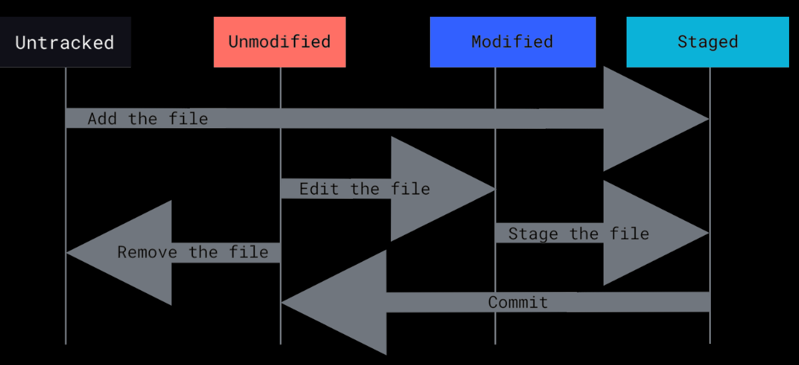
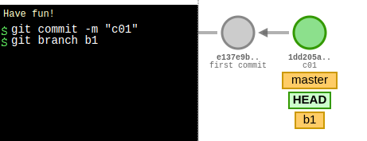
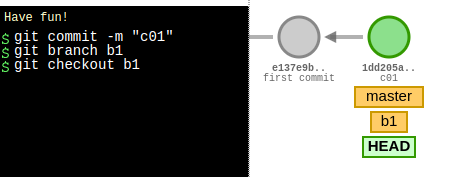
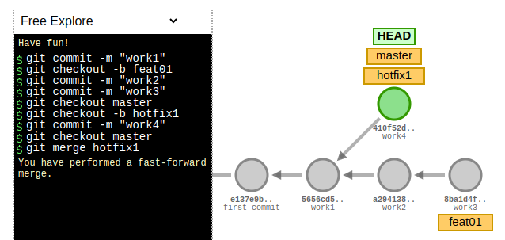
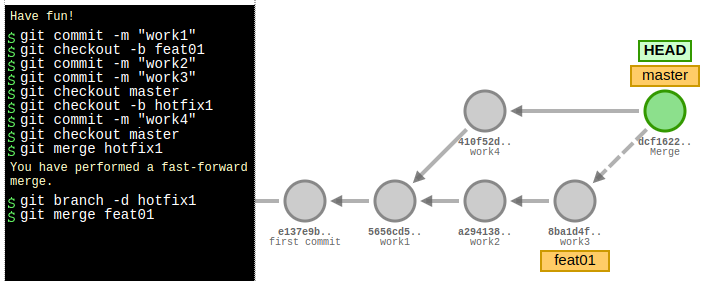
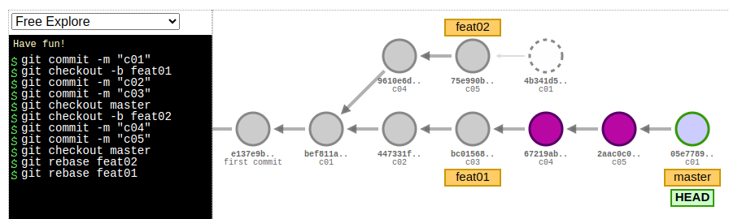

# Git (Table of Contents)

Fontes:

* Este é um resumo dos capítulos 2, 3 e 4 do livro Pro Git, do Scott Chacon
* [Merge vs Rebase](https://www.simplilearn.com/git-rebase-vs-merge-article#:~:text=The%20main%20difference%20between%20git,one%20branch%20onto%20another%20branch.)

Índice:

1. [Principais comandos](#principais-comandos)
1. [Help](#help)
1. [Configurando o Git](#configurando-o-git)
1. [Ciclo de vida do status de seus arquivos](#ciclo-de-vida-do-status-de-seus-arquivos)
1. [Getting a git repository](#getting-a-git-repository)
1. [Recording Changes to the Repository](#recording-changes-to-the-repository)
1. [Viewing the Commit History](#viewing-the-commit-history)
1. [Desfazendo as coisas](#desfazendo-as-coisas)
1. [Working with Remotes](#working-with-remotes)
1. [Tagging](#tagging)
1. [Branching](#branching)
1. [Merging](#merging)
1. [Rebase](#rebase)
1. [Merge vs. Rebase](#merge-vs-rebase)
1. [Estratégias de trabalho com o git](#estratégias-de-trabalho-com-o-git-chamados-de-branching-workflows)
1. [Aliases (atalhos)](#aliases-atalhos)
1. [Gerando uma nova chave SSH e adicionando-a ao agente SSH](#gerando-uma-nova-chave-ssh-e-adicionando-a-ao-agente-ssh)

## Principais comandos

[init](#init) | [clone](#clone) | [status](#checking-the-status-of-your-files) | [add](#tracking-new-files) | [diff](#viewing-your-staged-and-unstaged-changes) | [commit](#committing-your-changes) | [rm](#removing-files) | [mv](#renomeando-arquivos) | [log](#viewing-the-commit-history) | [remote](#para-ver-quais-servidores-remotos-estão-configurados) | [fetch](#fetching-from-your-remotes) | [pull](#pulling-from-your-remotes) | [push](#pushing-to-your-remotes) | [tag](#tagging) | [show](#show-tag-data) | [branch](#listando-branches) | [checkout](#alternando-entre-branches) | [merge](#mergeando-branches) | [rebase](#rebase)

## Help

If you ever need help while using Git, there are three equivalent ways to get the comprehensive manual page (manpage) help for any of the Git commands:

```git
git help <verb>
git <verb> --help
man git-<verb>
```

 [top](#git-table-of-contents)

## Ciclo de vida do status de seus arquivos



 [top](#git-table-of-contents)

## Configurando o Git

O Git vem com uma ferramenta chamada git config que permite obter e definir variáveis de configuração que controlam todos os aspectos da aparência e operação do Git. Essas variáveis podem ser armazenadas em três locais diferentes:

1. Arquivo /etc/gitconfig: Contém valores aplicados a cada usuário no sistema e todos os seus repositórios. Se você passar a opção `--system` para git config, ele lê e grava especificamente neste arquivo. (Como este é um arquivo de configuração do sistema, você precisaria de informações administrativas ou privilégio de superusuário para fazer alterações nele.)
2. Arquivo ~/.gitconfig ou ~/.config/git/config: Valores específicos pessoalmente para você, o usuário. Você pode fazer o Git ler e gravar neste arquivo especificamente passando a opção `--global`, e isso afeta todos os repositórios com os quais você trabalha em seu sistema.
3. arquivo de configuração no diretório Git (ou seja, .git/config) de qualquer repositório que você esteja usando atualmente: Específico para esse único repositório. Você pode forçar o Git a ler e gravar neste arquivo com a opção `--local`, mas esse é na verdade o padrão.

Para ver todas as configurações e onde elas estão configuradas, entre com o comando:

`git config --list --show-origin`

Para configurar a sua identidade:

`git config --global user.name "John Doe"`

`git config --global user.email <johndoe@example.com>`

Para configurar o editor padrão:

`git config --global core.editor emacs`

Caso opte pelo notepad++ `git config --global core.editor "'C:/Program Files/Notepad++/notepad++.exe' -multiInst -notabbar -nosession -noPlugin"`

Para configurar a ferramenta de merge preferida (opendiff kdiff3 tkdiff xxdiff meld tortoisemerge gvimdiff diffuse diffmerge ecmerge
p4merge araxis bc3 codecompare vimdiff emerge):

`git config merge.tool kdiff3`

## Getting a git repository

### Init

Para iniciar um repositório, primeiro vá até a pasta desejada e digite o comando:

`git init`

Será criada uma pasta .git com toda a estrutura necessária ao git, porém nenhum arquivo está sendo monitorado. Ainda será necessário realizar o 'add' e o "commit' nos arquivos que deseja monitorar.

Para iniciar um repositório remoto que só irá armazenar as alterações. Ele será o nosso servidor de git. Ninguém irá trabalhar diretamente nesta pasta.

`git init --bare`

### Clone

Para clonar um servidor e atribuir o nome da pasta que ele terá na sua máquina:

`git clone <url> <nome-pasta>`

url pode ser o endereço de um servidor git criado com o `git init --bare` ou um endereço web válido

Exemplos:

```git
git clone <https://github.com/libgit2/libgit2>
git clone <https://github.com/libgit2/libgit2> mylibgit
```

Para clonar um branch específico de um projeto

`Git clone <url> -b branchName`

Os seguintes protocolos são suportados pelo git:

* https://
* git:// e user@server:path/to/repo.git, which uses the SSH transfer protocol.

[top](#git-table-of-contents)

## Recording Changes to the Repository

### Checking the Status of Your Files

The main tool you use to determine which files are in which state is the `git status` command.

Se quiser uma saída mais simplificada para o comando este comando, use o parâmetro `-s` ou `--short`

| Símbolo | Descrição |
| ----------- | ----------- |
| ?? | Arquivos ainda não monitorados pelo git |
| A | new files that have been added to the staging area |
| M | modified files|

```git
$ git status -s
 M README
MM Rakefile
A  lib/git.rb
M  lib/simplegit.rb
?? LICENSE.txt
```

 There are two columns to the output - the left-hand column indicates the status of the staging area and the right-hand column indicates the status of the working tree. So for example in that output, the README file is modified in the working directory but not yet staged, while the lib/simplegit.rb file is modified and staged. The Rakefile was modified, staged and then modified again, so there are changes to it that are both staged and unstaged.

### Tracking New Files

Para levar um arquivo de Untracked para Staged:

```git
git add file_name
git add directory_name
git add .
```

The git add command takes a path name for either a file or a directory; if it’s a directory, the command adds all the files in that directory recursively.

### Staging Modified Files

O comando 'add' também é usando para tornar um aquivo alterado em 'staged for commit'

### Making merge-conflicted files as resolved

Também é usado para tornar 'resolvidos' arquivos com conflito no merge

__git add is a multipurpose command — you use it to begin tracking new files, to stage files, and to do other things like marking merge-conflicted files as
resolved. It may be helpful to think of it more as “add precisely this content to the next commit”__

### Ignoring Files

O arquivo .gitignore é usado para sinalizar ao git quais arquivos na pasta não devem ser monitorados

```git
*.[oa]
*~
```

The first line tells Git to ignore any files ending in “.o” or “.a” — object and archive files that may be the product of building your code. The second line tells Git to ignore all files whose names end with a tilde (~), which is used by many text editors such as Emacs to mark temporary files. You may also
include a log, tmp, or pid directory; automatically generated documentation; and so on.

### Viewing Your Staged and Unstaged Changes

To see what you’ve changed but not yet staged:

`git diff`

If you want to see what you’ve staged that will go into your next commit

`git diff --staged`

This command compares your staged changes to your last commit

### Committing Your Changes

Para commitar tudo que está em staged o comando é:

`git commit`

Remember that anything that is still unstaged — any files you have created or modified that you haven’t run git add on since you edited them — won’t go into this commit. They will stay as modified files on your disk.

A variante `git commit -v` abrirá o editor da sua preferência com o resultado do 'diff' para que seja possível ver exatamente o que está sendo comitado.

Outro opção é adicionar a mensagem inline:

`git commit -m "mensagem do commit"`

Quando vc precisa corrigir um commit, ou porque esquecer de acrescentar um arquivo ou porque errou na mensagem e deseja corrigir, use o `git add` para acrescentar o que falta e depois use o `commit --amend`. Neste caso o commit anterior nem será exibido no histórico. O nome commit passará a ser a única entrada no histórico.

### Skipping the Staging Area

Adicionando a opção `-a` ao command `git commit` fará que qualquer arquivo monitorado pelo git, mas ainda não incluído na area de stage, seja adicionado automaticamente. Arquivos não monitorados pelo git ficarão de fora do commit.

### Removing Files

Para remover um arquivo do Git, você tem que removê-lo dos arquivos monitorados (mais precisamente removê-lo da area de stage) e então fazer commit.

`git rm file_name`

Se você já modificou o arquivo ou já o adicionou a area de stage, você deve forçar a remoção com o opção `-f`.

Se quiser remover o arquivo da area de stage, mas ainda sim quer mantê-lo no disco, use a opção `--cached`. Isso é útil quando você acidentalmente adiciona a area de stage algum arquivo importante, que é necessário para o projeto, mas vc não precisa mantê-lo no Git.

### Renomeando arquivos

Assim como ocorre com o Linux, renomear um arquivo é feito através do comando `mv`.

`git mv file_from file_to`

O próprio Git considera essa operação com um renomeio.

[top](#git-table-of-contents)

## Viewing the Commit History

Para ver o histórico de alterações do repositório, o comando é o `git log`

De forma padrão, o `git log` irá exibir a lista de commits na ordem reversa cronologicamente, as mais recentes irão aparece primeiro.

A opção `-p` ou `--patch` mostra a diferença adicionada em cada commit e vc ainda pode adicionar um limite na quantidade de commits a serem exibidos.

`git log -p -2`

Outra opção importante é o `--pretty` que pode ser oneline, short, full, fuller, format

`git log --stat`

A opção `--stat` imprime abaixo de cada entrada de commit uma lista de arquivos modificados, quantos arquivos foram alterados e quantas linhas nesses arquivos foram adicionadas e removidas. Também coloca um resumo das informações no final.

`git log --pretty=format:"%h - %an, %ar : %s" -10`

| Option | Description of Output |
| ----- | ----- |
| %H | Commit hash |
| %h | Abbreviated commit hash |
| %T | Tree hash |
| %t | Abbreviated tree hash |
| %P | Parent hashes |
| %p | Abbreviated parent hashes |
| %an | Author name |
| %ae | Author email |
| %ad | Author date (format respects the `--date=option`) |
| %ar | Author date, relative |
| %cn | Committer name |
| %ce | Committer email |
| %cd | Committer date |
| %cr | Committer date, relative |
| %s | Subject |

O Author é a pessoa que escreveu originalmente o trabalho, enquanto o Committer é a pessoa que aplicou o trabalho (realizou o merge) pela última vez. Portanto, se você enviar um patch para um projeto e um dos membros principais mergear o patch, ambos receberão crédito — você como autor e o membro principal como committer.

`git log --pretty=oneline -2`

| Opção | Efeito | Exemplo |
| ----- | -----| ----- |
| `--since` | commits desde | `--since=2.weeks` `--since="2008-01-15"` `--since="2 years 1 day 3 minutes ago"` |
| `--until` | commits até | `--since="2008-01-15"` `--until="2008-02-15"` |
| `--author` | commits por autor | `--author='Junio C Hamano'` |
| `--grep` | filtra por palavra na mensagem | `--grep="layout"` |

You can specify more than one instance of both the `--author` and `--grep` search criteria, which will limit the commit output to commits that match any of the
`--author` patterns and any of the `--grep` patterns; however, adding the `--all-match` option further limits the output to just those commits that match all `--grep` patterns.

`git log --oneline --decorate` O decorate mostra para onde os ponteiros dos branches estão apontando.

`git log --all` irá exibir todos os branches, mesmo aqueles que estão a frente do HEAD no momento.

A parte de log tem outras opções muito interessantes sobre filtros, na página 44 até 46.

[top](#git-table-of-contents)

## Desfazendo as coisas

### Retirando um arquivo da area de stage

`git reset HEAD file_name`

O arquivo foi colocado na area de stage com o comando `add`, mas agora vc precisa retirá-lo dessa area.

### Desfazendo alterações em arquivo no diretório de trabalho

`git checkout -- file_name`

Aqui o arquivo foi alterado, mas ainda não foi dado o add. Dessa forma ele está alterado, mas não está na area de stage. Ex. `git checkout -- CONTRIBUTING.md`

[top](#git-table-of-contents)

## Working with Remotes

### Para ver quais servidores remotos estão configurados

```git
git remote (para listar os repositórios remotos que o repositório local conhece)
git remote -v (verbose para listar mais detalhes)
```

### Para fazer um repositório local conhecer um repositório remoto

```git
git remote add <name> <url> (a url pode ser um endereço local, na rede, na web)
git remote add pb <https://github.com/paulboone/ticgit>
```

### Inspecionar um remote

Para obter mais informações sobre um remote, vc usa o comando `git remote show nome_do_remote`. Ex.:  `git remote show origin`

Esse comando mostra:

* which branch is automatically pushed to when you run git push while on certain branches.
* which remote branches on the server you don’t yet have
* which remote branches you have that have been removed from the server, and multiple local branches that are able to merge automatically with their remote-tracking branch when you run git pull.

### Renomeando um remote

`git remote rename pb paul`

It’s worth mentioning that this changes all your remote-tracking branch names, too. What used to be referenced at pb/master is now at paul/master.

### Removendo um remote

`git remote remove paul`

Once you delete the reference to a remote this way, all remote-tracking branches and configuration settings associated with that remote are also deleted.

### Fetching from Your Remotes

`git fetch remote`

The command goes out to that remote project and pulls down all the data from that remote project that you don’t have yet. After you do this, you should have references to all the branches from that remote, which you can merge in or inspect at any time.

### Pulling from Your Remotes

`git Pull`

If your current branch is set up to track a remote branch (see the next section and Git Branching for more information), you can use the git pull command to automatically fetch and then merge that remote branch into your current branch.

Para baixar um branch específico, use `git pull nome-servidor-remoto nome-branch`

### Diferença entre fetch e pull

It’s important to note that the git fetch command only downloads the data to your local repository — it doesn’t automatically merge it with any of your work or
modify what you’re currently working on. You have to merge it manually into your work when you’re ready. Git pull command will automatically fetch and then merge that remote branch into your current branch.

### Pushing to Your Remotes

para subir um branch criado localmente para servidor remoto

`git push --set-upstream origin nome-branch`

This command works only if you cloned from a server to which you have write access and if nobody has pushed in the meantime. If you and someone else clone at the same time and they push upstream and then you push upstream, your push will rightly be rejected. You’ll have to fetch their work first and incorporate it into yours before you’ll be allowed to push. See Git Branching for more detailed information on how to push to remote servers.

[top](#git-table-of-contents)

## Tagging

Typically, people use this functionality to mark release points (v1.0, v2.0 and so on).

### Listing Your Tags

`git tag`
`git tag -l "v1.8.5*"` -> para listar apenas as tags da série 1.8.5 (`-l` ou `--list`)

### Creating annotated Tags

Annotated tags, however, are stored as full objects in the Git database. They’re checksummed; contain the tagger name, email, and date; have a tagging message; and can be signed and verified with GNU Privacy Guard (GPG). It’s generally recommended that you create annotated tags so you can have all this information;

`git tag -a v1.4 -m "my version 1.4"`

### Creating lightweight Tags

A lightweight tag is very much like a branch that doesn’t change — it’s just a pointer to a specific commit. To create a lightweight tag, don’t supply any of the `-a`, `-s`, or `-m` options, just provide a tag name

`git tag v1.4-lw`

### Tagging Later

Você também pode adicionar tag em commit que já não é o último commit feito. Para isso, comece com o `git log --pretty=oneline` para listar os commits já realizados.

Depois crie a tag adicionando o checksum ou parte dele ao final do commando `git tag -a v1.2 9fceb02`

### Show tag data

You can see the tag data along with the commit that was tagged by using the git show command.

`git show v1.4`

### Levando uma tag para o remote

By default, the git push command doesn’t transfer tags to remote servers. You will have to explicitly push tags to a shared server after you have created them.

`git push origin v1.5`

If you have a lot of tags that you want to push up at once, you can also use the `--tags` option to the git push command.

`git push origin --tags`

### Deletando tags

Deletando a tag localmente: `git tag -d v1.4-lw`
Depois, para deletar do remoto: `git push origin --delete v1.4-lw`

### Vendo o conteúdo de uma tag

`git checkout 2.0.0`

### Criando um novo branch a partir de uma tag

Se você precisa fazer mudanças, como corrigir um bug em uma versão antiga, por exemplo — você provavelmente irá querer criar um branch:

`git checkout -b version2 v2.0.0`

Se você fizer um commit, seu branch version2 será um pouco diferente de sua tag v2.0.0, pois avançará com suas novas alterações, então tome cuidado.

[top](#git-table-of-contents)

## Branching

### Listando branches

`git branch`

Para ver inclusive os branches que existem no remoto

`git branch -a`

Para ver o último commit em cada branch:

`git branch -v`

As opções úteis `--merged` e `--no-merged` podem filtrar esta lista para ramificações que você já mergiou ou ainda não com o branch em que está atualmente. Para ver quais branches já estão mergiados no branch em que você está, você pode executar `git branch --merged`.

Você também pode passar o branch a ser usado como referência:

`git branch --no-merged master`

### Criando um novo branch

`git branch testing`

Tecnicamente o comando cria um novo ponteiro para o mesmo commit em que você trabalhando atualmente.
Como o git sabe em qual commit você está trabalhando agora? Ele manter um ponteiro especial chamado HEAD, que aponta para o branch local corrente.



### Deletando um branch

local: `git branch -d nome_branch`

Remoto: `git push -d nome_branch`

### Alternando entre branches

`git checkout testing`

Esse comando move o ponteiro HEAD para o branch 'testing'

`git checkout -b iss53`

Esse comando cria o branch iss53 e alterna o HEAD para ele.

É importante notar que quando você troca de branch no Git, os arquivos em seu diretório de trabalho serão alterados. Se você mudar para um branch mais antigo, seu diretório de trabalho será revertido para a aparência da última vez que você fez commit naquele branch. Se o Git não puder fazer isso de forma limpa, ele não permitirá que você alterne.



### Branches remotos

`git ls-remote <remote>` ou `git remote show <remote>`

## Merging

### Mergeando branches

No merge você junta as alterações de um outro branch no branch apontado pelo HEAD.

```git
git checkout master
git merge hotfix
```

### "Fast-forward" merge



Note “fast-forward” no merge. Como o commit apontado pelo hotfix do branch no qual você fez o merge estava diretamente à frente do commit em que você está, o Git simplesmente move o ponteiro para frente. Em outras palavras, quando você tenta mesclar um commit com um commit que pode ser alcançado seguindo o histórico do primeiro commit, o Git simplifica as coisas movendo o ponteiro para frente porque não há trabalho divergente para mesclar - isso é chamado de “fast-forward”

### "Merge commit" merge



Neste caso o novo merge não foi do tipo “fast-forward”. O git criou um novo snapshot que resulta da junção dos branches, esse snapshot também sofreu um commit automático. Esse tipo de merge é chamado de "merge commit" e é especial porque resulta em um commit com mais de um pai.

### Merge conflits

`git mergetool`

## Rebase

Com o comando rebase vocÊ pode pegar todas as mudanças que foram commitadas em um branch e reaplicá-las em um branch diferente.

```git
git checkout experiment
git rebase master
```

Feito isso, agora é possível fazer um commit do tipo "fast-forward" nesse branch:

```git
git checkout master
git merge experiment
```

Ilustrando o processo:



Frequentemente, você fará isso para garantir que seus commits sejam aplicados corretamente em um branch remoto — talvez em um projeto para o qual você está tentando contribuir, mas que não mantém. Nesse caso, você faria seu trabalho em um branch e então faria um rebase do seu trabalho com Origin/master quando estivesse pronto para enviar seus patches para o projeto principal. Dessa forma, o mantenedor não precisa fazer nenhum trabalho de integração — apenas um fast-forward ou uma aplicação limpa.

Observação: Não faça rebase de commits que existem fora do seu repositório e nos quais as pessoas possam ter baseado seu trabalho. Em geral, a maneira de obter o melhor dos dois mundos (Merge vs. Rebase) é usar o rebase nas alterações locais que você fez, mas ainda não compartilhou, antes de dar um push, para limpar sua história, mas nunca usar rebase em algo que você já fez push em algum lugar.

## Merge vs. Rebase

A principal diferença entre git merge e git rebase é que git merge é uma maneira de combinar alterações de um branch (branch de origem) em outro branch (branch de destino), enquanto git rebase é uma maneira de mover as alterações de uma branch para outra branch.

Uma tabela ilustra melhor esse diferença:

| Merge | Rebase |
| ----- | ----- |
| Git Merge lets you merge different Git branches. | Git Rebase allows you to integrate the changes from one branch into another. |
| Git Merge logs show you the complete history of commit merging. | Git Rebase logs are linear. As the commits are rebased, the history is altered to reflect this. |
| All the commits on a feature branch are combined into a single commit on the master branch. | All commits are rebased, and the same number of commits are added to the master branch. |
| Merge is best used when the target branch is supposed to be shared. | Rebase is best used when the target branch is private. |
| Merge preserves history. | Rebase rewrites history. |

[Mais em ...](https://www.simplilearn.com/git-rebase-vs-merge-article#:~:text=The%20main%20difference%20between%20git,one%20branch%20onto%20another%20branch.)

## Estratégias de trabalho com o git (chamados de Branching workflows)

Alguns sites com referência para o assunto:

* [Comparing Git Workflows: What You Should Know](https://www.atlassian.com/git/tutorials/comparing-workflows)
* [5 Types of Git WorkFlow & Explanation of each Flow](https://razorops.com/blog/5-types-of-git-workflow-&-explanation-of-each-flow)
* [5 Different Git Workflows](https://medium.com/javarevisited/5-different-git-workflows-50f75d8783a7)

## Aliases (atalhos)

Você pode configurar atalhos no git usando o comando de configuração `git config --global alias`

| Configuração | Comando |
| ------- | ------- |
| `git config --global alias.co checkout` | `git co` |
| `git config --global alias.br branch` | `git br` |
| `git config --global alias.ci commit` | `git ci` |
| `git config --global alias.st status` | `git st` |
| `git config --global alias.pl pull` | `git pl` |
| `git config --global alias.ph push` | `git ph` |
| `git config --global alias.unstage 'reset HEAD --'` | `git unstage fileA` |
| `git config --global alias.last 'log -1 HEAD'` | `git last` |

[top](#git-table-of-contents)

## Gerando uma nova chave SSH e adicionando-a ao agente SSH

Página oficial para os 3 maiores versionadores que eu utilizo:

* <a href="https://docs.github.com/pt/authentication/connecting-to-github-with-ssh/generating-a-new-ssh-key-and-adding-it-to-the-ssh-agent" target="_blank">Github</a>
* <a href="https://docs.gitlab.com/ee/user/ssh.html#generate-an-ssh-key-pair" target="_blank">Gitlab</a>
* <a href="https://www.atlassian.com/br/git/tutorials/git-ssh" target="_blank">Bitbucket</a>

### Gerando a chave

* Inicie verificando se há chaves ssh registradas no seu Linux: `ls -al /home/jeann/.ssh`
  * troquei "jeann" pelo seu usuário.
* No Terminal entre com o comando: `ssh-keygen -t ed25519 -C "<your_email@example.com>"`
  * Irá aparecer a pergunta: "Enter a file in which to save the key (/home/YOU/.ssh/ALGORITHM):[Press enter]". Aqui vc vai precisar alterar o nome do arquivo caso já existam chaves cadastradas com o nome padrão, senão vai dar erro.
* Vai pedir uma senha. No prompt, digite uma frase secreta segura.

### Guardando a chave no Ubuntu

1. `eval "$(ssh-agent -s)"`
1. `ssh-add -k ~/.ssh/id_ed25519` (cuidado, verificar antes o nome do arquivo da chave, que pode ser diferente)

### Guardando a chave no Mac

1. `eval "$(ssh-agent -s)"`
1. `ssh-add --apple-use-keychain ~/.ssh/id_ed25519`  (cuidado, verificar antes o nome do arquivo da chave, que pode ser diferente)

### Guardando a chave no Windows

Abra o Git Bash, que provavelmente foi instalado pelo instalador do Git.

1. `eval "$(ssh-agent -s)"`
1. `ssh-add ~/.ssh/id_ed25519`   (cuidado, verificar antes o nome do arquivo da chave, que pode ser diferente)

### Adicionar a chave gerado ao seu versionador

* [github](https://docs.github.com/pt/authentication/connecting-to-github-with-ssh/adding-a-new-ssh-key-to-your-github-account)
* [gitlab](https://docs.gitlab.com/ee/user/ssh.html#add-an-ssh-key-to-your-gitlab-account)

### Testando a comunicação com o servidor através do ssh

`ssh -T git@github.com`

Também vai funcionar para `git@gitlab.com` e `git@bitbucket.com`

[top](#git-table-of-contents)
