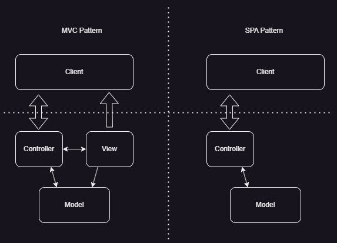

# ASP.NET Core

Fontes:

* [Pro ASP.NET Core 6, Adam Freeman](https://www.manning.com/books/pro-aspdotnet-core-7-tenth-edition)

## Table of contents

1. [Conceitos básicos](#comandos-básicos)

## Comandos básicos

Os principais componentes do ASP.Net Core podem ser visto da seguintes forma:

### MVC Framework

MVC significa Model-View-Controller, que é um padrão de projeto que descreve a forma de uma aplicação. O padrão MVC enfatiza a separação de conceitos, onde cada area da funcionalidade é definida independentemente.

O framework MVC continua sendo uma parte importante do ASP.NET Core, mas a maneira como é usado tem mudado com o avanço do single-page applications (SPAs). Em SPA, o navegador faz uma única requisição HTTP e recebe um documento HTML que entrega uma interface rica para o cliente, tipicamente escrita em JavaScript como Angular ou React. Essa mudança para SPAs significa que as separações claras que MVC Framework original se baseou não são tão importante e seguir religiosamente o padrão já não é tão essencial. O MVC Framework permanece util, sendo principalmente usado como suporte para SPAs através de Web Services.

Na imagem acima podemos ver essa diferença. Nas SPAs a responsabilidade da View fica do lado do cliente, que recebe o dado da controle e se responsabiliza pelas administração do DOM para que a página seja atualizada. No MVC essa responsabilidade é atribuída ao servidor, que devolve ao cliente um documento HTML já previamente construído.

### Razor Pages

O Razor Pages adota o espírito de desenvolvimento das Web Pages e o implementa usando os recursos da plataforma originalmente desenvolvidos para o MVC Framework. Código e conteúdo são misturados para formar páginas independentes; isso recria a velocidade de desenvolvimento de Web Pages sem alguns dos problemas técnicos subjacentes. Razor Pages pode ser usado junto com o MVC Framework.

### Blazor

O Blazor permite que C# seja usado para escrever aplicativos do lado do cliente. Existem duas versões do Blazor: Blazor Server e Blazor WebAssembly. Blazor Server é uma parte estável e suportada do ASP.NET Core e funciona usando uma conexão HTTP persistente com o servidor ASP.NET Core, onde o código C# do aplicativo é executado. Blazor WebAssembly é uma versão experimental que vai um passo além e executa o código C# do aplicativo no navegador. Nenhuma das versões do Blazor é adequada para todas as situações.

### ASP.NET Core Platform

A plataforma ASP.NET Core contém os recursos de baixo nível necessários para receber e processar solicitações HTTP e criar respostas. Há um servidor HTTP integrado, um sistema de componentes de middleware para lidar com solicitações e recursos básicos dos quais as estruturas do aplicativo dependem, como roteamento de URL e o mecanismo de visualização Razor.
